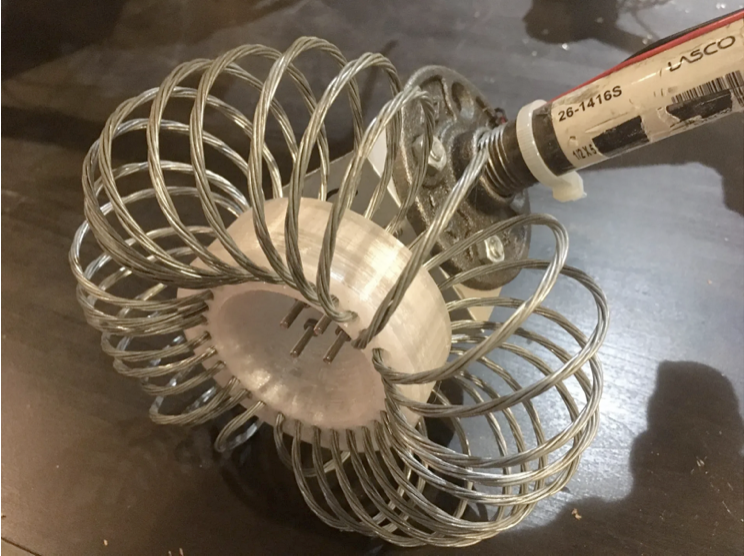

# Rover

This repository contains files related to my ongoing project to build a working all-terrain robot with a rocker-bogie suspension system. Currently those are CAD files for the wheel design (see description below), which can be found in the `wheels` folder.

|  |
| :----------------------------------------------------: |
|             The rover, assembled             |

## The Suspension System

This rover uses a rocker-bogie suspension system constructed with two diameters of electrical conduit.

## The Wheel Design

The wheels use an airless tire design where central 3d-printed core is surrounded by a toroidal helical coil of cable. In my testing, they work pretty well on dirt, grass, and rock. I was inspired by NASA’s airless tire prototypes. I have also published the designs for the wheels on printables here

|  |
| :--------------------------------------: |
|           One wheel, assembled           |

